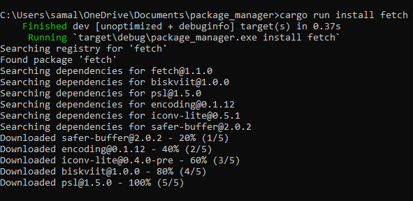

# Node Package Manager

## About
A neat little package manager hooked up to the NPM registry made in Rust. This took me 2 days so it has a few issues, sometimes it works sometimes it doesn't.



## Usage
**Build**
```sh
cargo build
```

**Execute**
```sh
[binary name] install [npm package name]
```